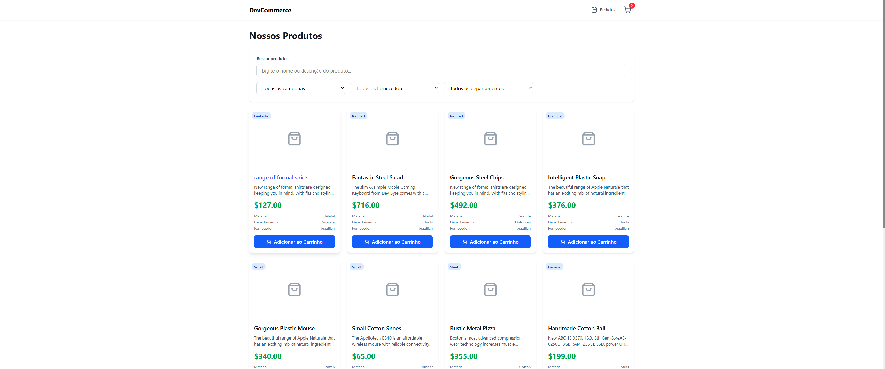
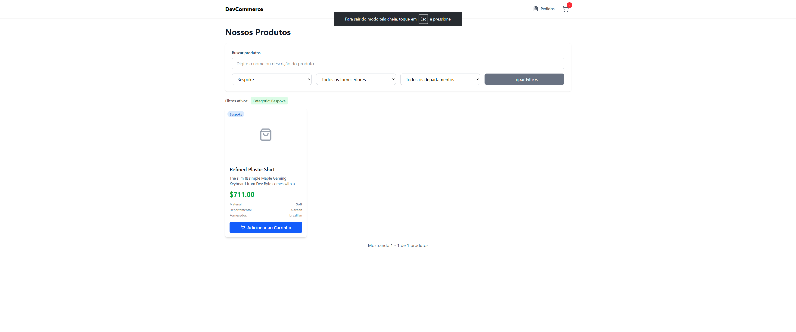
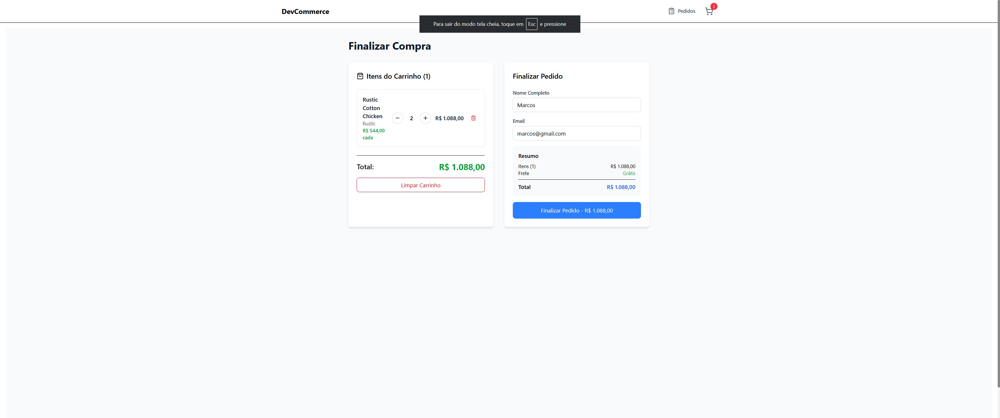
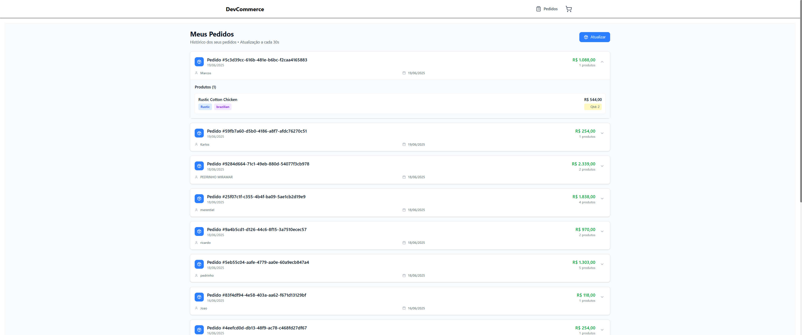
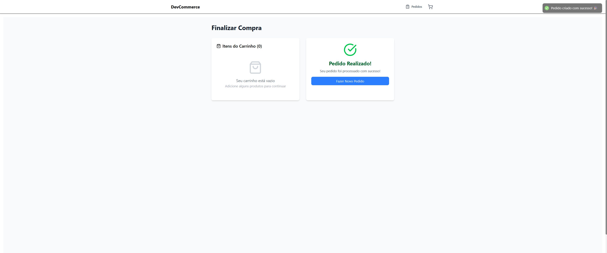

# Devnology Ecommerce. 

**Instale as dependências:**
   ```bash
   npm install
   ```
4. **Configure o backend:**
   - O backend deve estar rodando em http://localhost:3000
   - Configure o arquivo `.env`:
     ```bash
     VITE_BASE_URL_API=http://localhost:3000
     ```
5. **Inicie o projeto:**
   ```bash
   npm run dev
   ```
6. **Acesse:**
   - http://localhost:5173

### 📋 Scripts disponíveis
```bash
npm run dev      # Inicia em modo desenvolvimento
npm run build    # Build para produção
npm run preview  # Preview do build
npm run test     # Executa testes
npm run lint     # Verifica código com ESLint
```

### 🔧 Configuração adicional
- Certifique-se de que o **backend** esteja rodando primeiro
- O frontend depende da API para buscar produtos e registrar pedidos
- Para rodar os **testes**: `npm run test`

Aplicação web em React + TypeScript para e-commerce, integrando produtos de dois fornecedores, com busca, filtros, carrinho e finalização de compra.

## 🚀 Como rodar

1. **Pré-requisitos:**
   - Node.js 18+
   - npm ou yarn
   - Git

2. **Clone o repositório:**
   ```bash
   git clone https://github.com/PhelipeG/teste-tecnico-fullstack.git
   cd devnology-ecommerce/frontend
   ```

3. **Instale as dependências:**
   ```bash
   npm install
   ```
3. **Configure o backend:**
   - O backend deve estar rodando em http://localhost:3000
   - Configure o arquivo `.env`:
     ```bash
     VITE_BASE_URL_API=http://localhost:3000
     ```
4. **Inicie o projeto:**
   ```bash
   npm run dev
   ```
5. **Acesse:**
   - http://localhost:5173

## 🛠️ Tecnologias utilizadas
- **React**: componentização, reatividade e comunidade forte.
- **TypeScript**: segurança de tipos e manutenção.
- **Vite**: build rápido e hot reload eficiente.
- **Tailwind CSS**: estilização rápida e responsiva.
- **React Query**: gerenciamento de dados de API com cache.
- **React Hook Form + Zod**: formulários performáticos e validação robusta.
- **Axios**: requisições HTTP tipadas.
- **Vitest + Testing Library**: testes rápidos e focados no usuário.

## 📐 Arquitetura e decisões técnicas
- **Componentização**: Separação clara de componentes, páginas, contextos e serviços.
- **Context API**: Gerenciamento global do carrinho, simples e eficiente para apps pequenos/médios.
- **Validação e UX**: Formulários validados com feedback instantâneo.
- **Performance**: Filtros e buscas feitos via API, evitando processamento local.
- **Quantidade no carrinho**: Cada item do pedido envia a quantidade correta para o backend.
- **Filtro por provedor**: Permite filtrar produtos por fornecedor (brasileiro/europeu).

## ✨ Funcionalidades
- Listagem de produtos de dois fornecedores
- Busca por nome
- Filtro por categoria e provedor
- Carrinho de compras com quantidade
- Finalização de compra com formulário
- Integração com backend próprio para registrar pedidos
- Testes automatizados de componentes e API

## 📸 Screenshots

### Tela Principal (Home)

*Listagem de produtos com busca e filtros por categoria e provedor*

### Filtros

*Sistema de filtros por categoria e provedor (Brasileiro/Europeu)*

### Carrinho de Compras

*Carrinho com produtos, quantidades e formulário de finalização*

### Histórico de Pedidos

*Lista de pedidos realizados com detalhes dos produtos*

### Confirmação de Pedido

*Confirmação de pedido realizado com sucesso*

## 📁 Estrutura resumida
```
src/
  components/    # Componentes reutilizáveis
  pages/         # Páginas principais
  context/       # Contextos React
  api/           # Funções de API
  __tests__/     # Testes automatizados
```

---
Desenvolvido com React + TypeScript, focando em clareza, boas práticas e experiência do usuário.